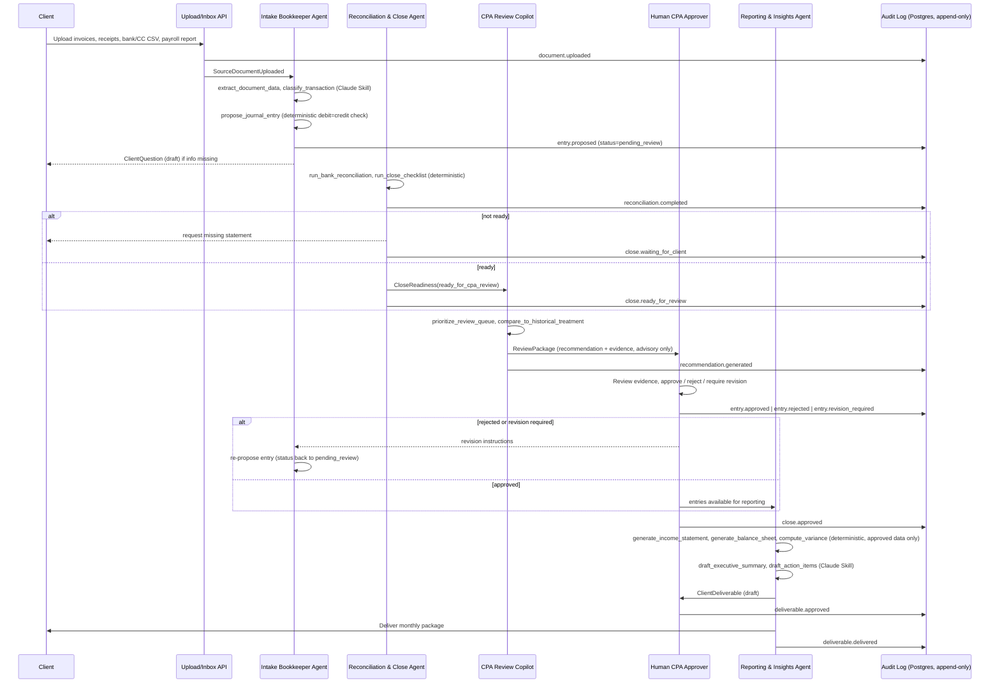
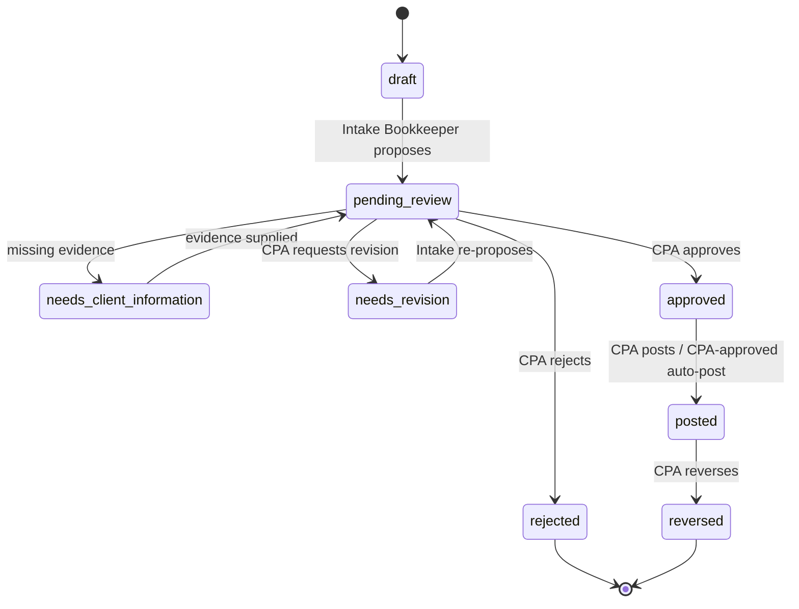
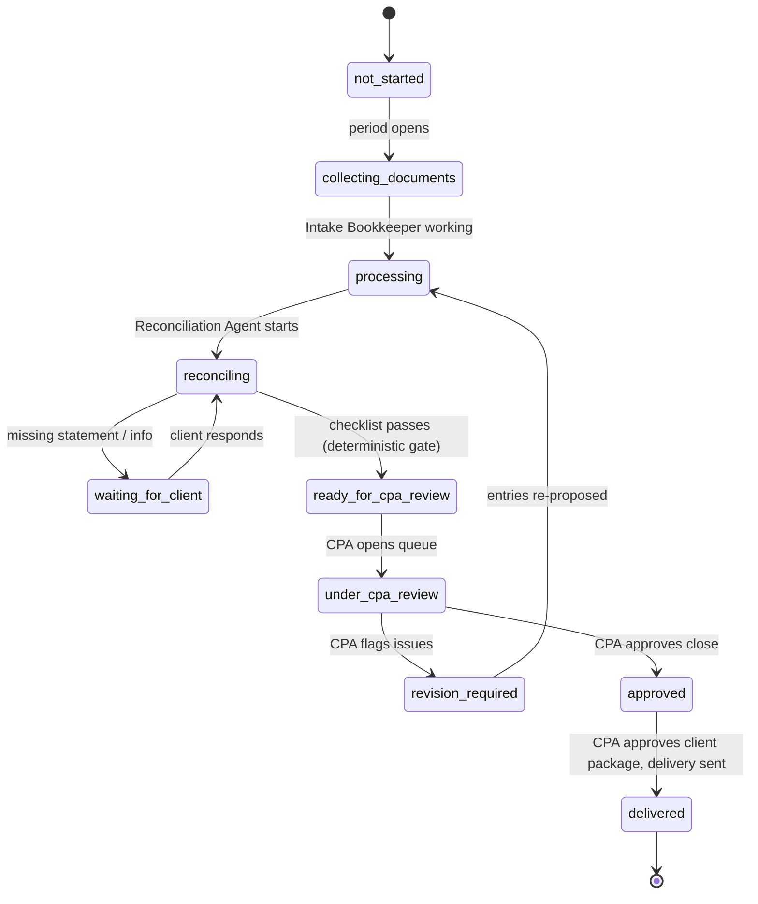
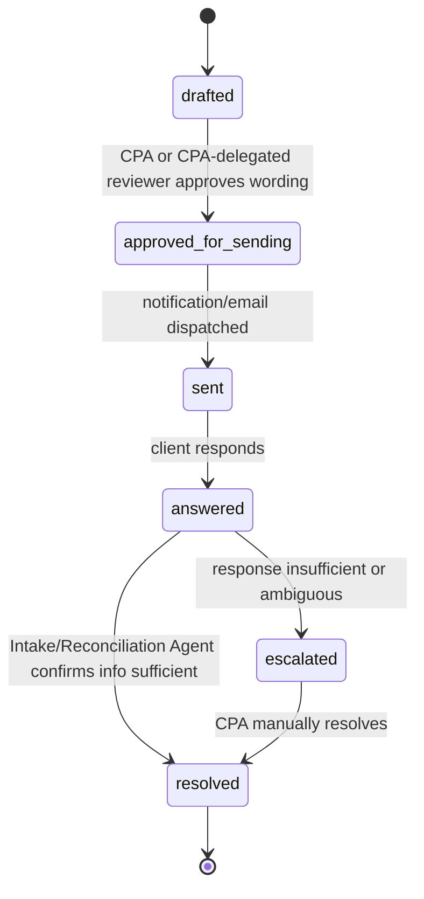
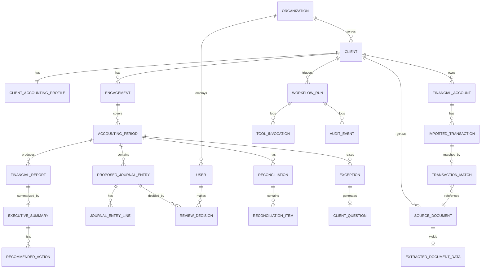

# Datum AI — CPA-Supervised Bookkeeping Team: MVP Implementation Plan

**Status:** Planning only. No production code has been written or modified to produce this document.
**Repository assessed:** `datumai-online/senior-accountant` (branch `claude/datum-ai-mvp-plan-1hldf2`, HEAD `c5f8e8b`)
**Assessment date:** 2026-08-04

---

## 1. Executive Summary

`datumai-online/senior-accountant` currently contains a single-endpoint FastAPI
proof-of-concept ("datum-skill-brain") that sends a transaction description to
Claude and returns a category, a confidence score, and a tax-deductibility
guess. That is the entire codebase: 14 tracked files, ~566 lines, no database,
no auth, no tests, no Docker/CI, no Claude Agent Skills, no n8n, no audit
trail, no multi-tenancy, and no accounting logic (no chart of accounts, no
double-entry validation, no reconciliation). This is a scaffold, not a
partial product — every capability in this plan beyond the classify-a-
transaction call is genuinely new work (`BUILD`).

That is good news for architecture: there is no legacy to work around. This
plan recommends building the whole product as **one modular monolith inside
this repository** (per founder direction), organized around four narrowly
scoped AI agents and one non-negotiable control: **the database itself, not
just the API layer, must make it physically impossible for any AI-controlled
credential to move a record into an approved/posted state.**

The recommended MVP is narrower than the full feature list in the founders'
brief: manual/CSV document and transaction upload (no live QuickBooks Online
OAuth yet), one synthetic demo client, single-CPA review queue (the founder
is the CPA), and no money movement, payroll execution, or tax filing of any
kind. QBO OAuth, real email/document-storage integration, and n8n
orchestration move to Phase 2, once there is a real founding customer to
integrate against — building live integrations before the first paying pilot
is validated is the biggest near-term source of wasted engineering effort.

Four agents are retained as scoped (Intake Bookkeeper, Reconciliation & Close,
CPA Review Copilot, Reporting & Insights), but "supporting capabilities"
(onboarding, document requests, notifications, task tracking) are explicitly
**not** agents — they are deterministic services and background jobs. All
arithmetic (debit=credit, trial balance, reconciliation matching, variance
calculation) is deterministic Python, never LLM output. The CPA Review
Copilot recommends; only an authenticated human CPA endpoint, backed by a
separate database role with no path to `approved`/`posted` for any AI
credential, can actually approve.

---

## 2. Repository Assessment

No files were modified to produce this assessment. All claims below are
sourced from direct reads of the repository tree, `git log`, and
`requirements.txt`.

| Component | Current Status | Evidence in Repository | Reusable? | Missing Work | Priority |
|---|---|---|---|---|---|
| FastAPI app skeleton | Existing, functional | `app/main.py` (50 lines): app init, CORS middleware, root route, router mount | **Yes** — keep as the base of the monolith | Add lifespan/startup DB pool, structured logging, versioned routers per domain | P0 |
| API layer | Existing, minimal | `app/api/routes.py` (64 lines): `GET /api/v1/health`, `POST /api/v1/classify` | Partial — pattern reusable, endpoints themselves are not the product surface | Add ~30+ resource endpoints (clients, documents, transactions, entries, reconciliations, reviews, reports) under RBAC | P0 |
| Config management | Existing, functional | `app/core/config.py`: `pydantic-settings` `Settings`, `.env.example` | **Yes** | Extend for DB URL, JWT secret, QBO/email/storage credentials, per-environment settings | P1 |
| Claude API wrapper | Existing, functional | `app/services/claude_service.py` (149 lines): typed errors, defensive JSON extraction, Pydantic validation of model output | **Yes, as a pattern** — this is the right shape for Skill-calling tools | Generalize into a reusable `ClaudeSkillClient` used by all four agents; move the hardcoded prompt into a versioned Skill | P1 |
| Pydantic DTOs | Existing, narrow | `app/schemas/transaction.py`: `TransactionIn`, `TransactionClassification`, `ClassifyResponse` | Partial | Not persisted, no tenant/client scoping, no evidence links, no confidence-driven exception flag | P1 |
| Database / ORM / migrations | **Missing entirely** | No `sqlalchemy`, `alembic`, or `psycopg2`/`asyncpg` in `requirements.txt`; no `models/` directory | No | Full data model (Section 8), Alembic migration pipeline | P0 |
| Authentication / RBAC | **Missing entirely** | No JWT/session code; CORS `allow_origins=["*"]` by default (`app/main.py`); no `Depends()` auth guard anywhere; README lists auth as a TODO | No | Full RBAC (AI service accounts, CPA role, admin), JWT issuance, DB-level role separation | P0 |
| State machines / workflow status | **Missing entirely** | No status enums, no workflow library, anywhere in the codebase | No | Accounting Entry, Monthly Close, Client Question state machines (Section 7) | P0 |
| Audit logging | **Missing entirely** | Only stdlib `logging` (INFO-level operational logs in `main.py`/`routes.py`/`claude_service.py`); no `AuditLog` model or table | No | Append-only `AuditEvent` table + enforcement that nothing can `UPDATE`/`DELETE` it | P0 |
| Multi-tenancy | **Missing entirely** | No `tenant_id`/`client_id`/`organization_id` field anywhere in schemas or code | No | `Organization`→`Client`→`Engagement` hierarchy with row-level scoping on every table | P0 |
| Automated tests | **Missing entirely** | No `tests/` directory, no `pytest` in `requirements.txt`; README explicitly lists tests as future work | No | Unit/integration/e2e suite (Section 14), including DB-level permission tests | P0 |
| Claude Agent Skills | **Missing entirely** | No `SKILL.md`, no `.claude/skills/` directory in-repo (the "Skill Brain" name is branding, not an Agent Skill artifact) | No | One versioned Skill per agent (Section 9) | P1 |
| n8n workflows | **Missing entirely** | No workflow JSON, no n8n references anywhere | No | Deferred to Phase 2 (Section 16) | P2 |
| MCP | **Missing entirely** | No `mcp.json`, no MCP server code | No | Only if a real cross-tool need emerges post-MVP; not required for MVP | P3 |
| QuickBooks Online integration | **Missing entirely** | No QBO SDK, OAuth code, or references | No | Deferred to Phase 2, gated on a real pilot client | P2 |
| Email integration | **Missing entirely** | No `imaplib`/`smtplib`/SendGrid code | No | Deferred to Phase 2 (client questions, document requests can start as in-app only) | P2 |
| Document storage integration | **Missing entirely** | No S3/GCS/Azure Blob code | No | MVP: local/dev object storage behind an interface; Phase 2: real bucket + encryption at rest | P1 |
| Payroll-provider integration | **Missing entirely** | No payroll SDK/parsing code | No | MVP: manual payroll-report upload + deterministic parsing for one provider format (e.g. Gusto CSV/PDF); live API deferred | P2 |
| Financial reporting | **Missing entirely** | No aggregation, no statement templates | No | Deterministic P&L/Balance Sheet/Cash Summary generation from approved entries only (Section 9) | P0 |
| Docker / CI | **Missing entirely** | No `Dockerfile`, no `docker-compose.yml`, no `.github/` directory at all | No | Dockerfile, docker-compose (app+Postgres), GitHub Actions (lint/test/build) | P0 |
| Documentation | README only | `README.md` (159 lines): setup, API reference for the 2 existing endpoints, an honest "Next steps for production" TODO list | Partial | Architecture doc, this plan, per-agent runbooks | P1 |
| Governance | **Missing entirely** | No `LICENSE`, `CODEOWNERS`, issue/PR templates | No | Add before opening the repo to any external collaborator | P3 |

**Technical debt:** none in the traditional sense (too little code exists to
have accrued debt) — the real risk is *scope debt*: building agent
orchestration before the deterministic substrate (DB, RBAC, state machines,
tests) exists would immediately create debt.

**Security weaknesses today:** wide-open CORS (`*`), zero authentication on
the one mutating endpoint (`/api/v1/classify`), no rate limiting, no secrets
manager (plain `.env`). None of these are urgent in isolation (there is no
real data to protect yet), but all must close before any endpoint touches
real client financial data.

**Missing documentation:** no architecture doc, no data model, no runbooks,
no security/compliance posture — this plan is the first artifact of that
kind in the repository.

---

## 3. Recommended MVP

**MVP definition:** the narrowest slice that can run the full
collect→prepare→reconcile→CPA-review→approve→report→deliver loop end-to-end
for one synthetic demo client, provable by tests and a recorded demo, without
touching real money, real tax filings, or a real customer's live QuickBooks
account.

| Capability (from founders' list) | MVP Scope | Label |
|---|---|---|
| Client accounting profile | Single profile per client: entity type, industry, COA template, materiality threshold, bank/CC accounts, payroll provider name | `BUILD` |
| Document upload / accounting inbox | Authenticated file upload endpoint + storage interface (local disk/dev bucket behind an S3-shaped interface) | `BUILD` |
| Invoice and receipt extraction | Claude Skill extracts structured fields from uploaded PDFs/images; confidence score attached | `BUILD` |
| Bank / credit-card transaction import | CSV/OFX upload parser (deterministic), not live bank-feed API | `BUILD` |
| Transaction classification | Claude Skill proposes GL account + confidence; deterministic COA validation | `BUILD` (extends `claude_service.py` pattern) |
| Proposed journal entries | Structured `ProposedJournalEntry` + `JournalEntryLine`, `pending_review` only | `BUILD` |
| Source-document links | Every proposed entry references ≥1 `SourceDocument` id | `BUILD` |
| Confidence scores | Numeric 0–1 on every AI-proposed classification/entry | `BUILD` |
| Exception identification | Deterministic rules + confidence threshold trigger `Exception` records (taxonomy in Section 12) | `BUILD` |
| Bank reconciliation | Deterministic matching (imported txns vs. proposed entries), unmatched/uncleared tracking | `BUILD` |
| Credit-card reconciliation | Same engine as bank reconciliation, different account type | `BUILD` |
| Payroll report reconciliation | Manual payroll report upload, deterministic parse for **one** provider format (Gusto summary PDF/CSV chosen as reference), match to GL payroll clearing account | `BUILD` (narrow: one provider format only) |
| Monthly close checklist | Deterministic checklist service (all accounts reconciled, no unresolved exceptions, no missing statements) gates `ready_for_cpa_review` | `BUILD` |
| CPA review queue | Prioritized list (severity, materiality, age) of pending entries/exceptions | `BUILD` |
| CPA approval and rejection | CPA-only endpoints, separate router, separate DB role (Section 10) | `BUILD` |
| Financial statements | Income statement, balance sheet, cash summary — from `approved`/`posted` entries only | `BUILD` |
| Period-over-period variance analysis | Deterministic comparison to prior period; Claude drafts the narrative, does not compute the numbers | `BUILD` |
| Executive summary | One-page Claude-drafted summary, CPA-approved before delivery | `BUILD` |
| Recommended action items | Claude-drafted, CPA-approved before delivery, explicitly labeled as bookkeeping observations, not tax/legal/investment advice | `BUILD` |
| Client questions / missing-document requests | Structured `ClientQuestion` records, in-app only for MVP (no live email send) | `BUILD` |
| Complete audit trail | Append-only `AuditEvent` table covering every state transition and AI tool call | `BUILD` |

### 3.1 What is explicitly IN the demonstrable Phase 1 loop
Upload → extract → classify → propose entries → reconcile → checklist gate →
CPA review queue → CPA approve/reject → statements → variance → executive
summary → CPA approve deliverable → (simulated) client delivery → audit log
retained throughout.

### 3.2 What is deliberately thin in Phase 1 (not absent, just minimal)
- One synthetic demo client with realistic but fabricated data (service
  business, ~$1–2M revenue, QBO-style chart of accounts).
- Payroll reconciliation supports one provider's report format only.
- Client questions are visible in-app; no outbound email send.
- No live QuickBooks connection — QBO-formatted CSV/JSON export used as the
  transaction-import source so the schema is QBO-compatible from day one
  even though the OAuth integration itself is deferred.

---

## 4. Scope Exclusions

| Excluded Capability | Why Postponed |
|---|---|
| Running payroll | Regulated, high-liability, commodity-solved by Gusto/ADP/Paychex/Rippling. Datum AI's value is accounting oversight, not payroll execution — building this would be pure scope creep and a licensing/liability magnet. |
| Moving money (payments, transfers, bill pay) | Money movement requires money-transmitter/agent-of-payee compliance, fraud controls, and a completely different risk posture than "prepare and review books." Out of scope indefinitely unless a dedicated compliance workstream is funded. |
| Paying bills | Same as above — AP automation vendors (Bill.com, Ramp) already solve this; integrate later, don't build. |
| Filing tax returns | Requires a different professional engagement, different liability envelope, and (often) a separate license/PTIN posture. Explicitly out of scope for the bookkeeping product. |
| Sales-tax filing | Jurisdictionally complex (nexus rules per state), high penalty risk if automated incorrectly. Integrate with Avalara/TaxJar later if demand emerges. |
| Tax advice | The product's Claude-drafted output must never render a tax opinion. Categorization output (e.g. "likely deductible") is a bookkeeping observation for CPA confirmation, not advice, and must be labeled as such everywhere it appears. |
| Investment advice | Entirely outside the bookkeeping/accounting engagement scope and regulatory perimeter (would implicate investment-adviser regulation). |
| Legal advice | Same rationale — outside scope and licensing. |
| Autonomous customer collections | Any AR-collections messaging sent "autonomously" to a client's customers creates legal (FDCPA-adjacent, though B2B) and reputational risk with zero human check. Defer indefinitely; AR *monitoring* (Phase 3) is fine, autonomous *collection* is not. |
| Proprietary CRM | Client/engagement tracking needed for the MVP is a handful of tables inside this monolith, not a CRM product. Do not build pipeline/lead-management features. |
| Full accounting platform / GL from scratch | QuickBooks Online already is the ledger of record for target clients. Datum AI prepares, reconciles, and reviews; it does not replace the GL. Only build the minimum internal tables needed to stage work before it's approved and (in later phases) posted to QBO. |
| Live QuickBooks Online OAuth (Phase 1) | No founding customer is lined up yet (per founder input); building a live integration before there's a real account to integrate against risks significant wasted engineering effort. QBO-shaped data formats are used from day one so the later integration is additive, not a rewrite. |
| Multi-provider payroll support (Phase 1) | One reference format proves the reconciliation pattern; broadening providers is additive work, not a redesign, and should wait for real client demand. |
| CPA reviewer load-balancing / multi-reviewer assignment | Founder is the sole CPA reviewer for the pilot; this is genuinely unneeded until Phase 3. |

---

## 5. Agent Architecture

### 5.1 Agent-count decision

The founders' four-agent structure is retained as-is — each agent has a
distinct trigger, a distinct output artifact, and a distinct escalation
shape, which is the right test for "does this deserve to be its own agent."
Two changes are recommended:

1. **Supporting capabilities are not agents.** Onboarding, document requests,
   client-question drafting mechanics, notifications, and task tracking are
   implemented as deterministic FastAPI services and background jobs
   (optionally triggered via n8n in Phase 2). Wrapping these in an LLM agent
   would add non-determinism and audit surface with no corresponding
   business benefit.
2. **Reconciliation math is not agent work.** The "Reconciliation and Close
   Agent" orchestrates and narrates, but transaction matching, balance
   checks, uncleared-item aging, and the close-readiness gate are
   deterministic Python functions the agent calls as tools — never
   LLM-computed. This is restated explicitly in Section 9.

### 5.2 Agent 1 — Intake Bookkeeper Agent

| Field | Description |
|---|---|
| Mission | Turn uploaded documents and imported transactions into evidence-linked, confidence-scored proposed journal entries, entering only `pending_review`. |
| Inputs | `SourceDocument` (invoice/receipt/statement/payroll report), `ImportedTransaction` batch, `ClientAccountingProfile` (COA, materiality, known vendors) |
| Tools | `extract_document_data`, `match_transaction_to_document`, `classify_transaction`, `propose_journal_entry`, `flag_exception`, `detect_duplicate_document` (Section 9) |
| Outputs | `ExtractedDocumentData`, `TransactionMatch`, `ProposedJournalEntry` + `JournalEntryLine`, `Exception` records |
| Allowed Actions | Create/update records in `draft` or `pending_review` only; attach evidence links; assign confidence scores; create `Exception` records |
| Prohibited Actions | Cannot set any status to `approved`/`posted`/`rejected`; cannot delete any record; cannot modify `ClientAccountingProfile` policy fields (only CPA-approved policy changes may) |
| Escalation Rules | Confidence below client's threshold; new vendor/counterparty; amount above materiality; duplicate suspected; document unreadable |
| Failure Handling | Extraction failure → `Exception` type `unreadable_document`, entry stays `needs_client_information`; Claude API failure → typed error surfaced, job retried with backoff, then escalated to CPA queue if retries exhausted |
| Audit Requirements | Every extraction call, every proposed entry, every confidence score, every exception raised, Skill version used, timestamp |
| Evaluation Metrics | Extraction accuracy, classification accuracy, false-exception rate, evidence-linkage completeness (Section 14) |

### 5.3 Agent 2 — Reconciliation and Close Agent

| Field | Description |
|---|---|
| Mission | Determine whether an accounting period's books are ready for CPA review by reconciling every account and running the close checklist. |
| Inputs | `ImportedTransaction`s, `ProposedJournalEntry`s, prior-period `Reconciliation` records, payroll reports |
| Tools | `run_bank_reconciliation`, `run_close_checklist`, `detect_unmatched_transactions` (all deterministic; agent calls them and narrates results), `flag_exception` |
| Outputs | `Reconciliation` + `ReconciliationItem` records, close-checklist status, `Exception` records for unusual balances/unmatched items |
| Allowed Actions | Create/update `Reconciliation` records; mark checklist items complete; move `MonthlyClose` to `ready_for_cpa_review` (a preparation state, not an approval state) |
| Prohibited Actions | Cannot move `MonthlyClose` to `approved`; cannot post any journal entry; cannot delete transactions |
| Escalation Rules | Missing bank/CC statement; unreconciled variance above threshold; negative balance where none expected; stale uncleared items (>1 period) |
| Failure Handling | Missing statement → checklist item blocked, client-question drafted, close stays `waiting_for_client`; reconciliation math failure is a bug (deterministic code), not an agent retry case — alerts engineering |
| Audit Requirements | Every reconciliation run, inputs used, resulting matched/unmatched counts, checklist state transitions |
| Evaluation Metrics | Reconciliation accuracy (against seeded ground truth), false-positive unmatched rate, time-to-ready-for-review |

### 5.4 Agent 3 — CPA Review Copilot

| Field | Description |
|---|---|
| Mission | Prepare the CPA's review queue: prioritize, cross-check evidence, compare to history, and recommend a decision — never make the decision. |
| Inputs | `pending_review` entries, `Exception` records, historical `ReviewDecision`s, `ClientAccountingProfile` policies |
| Tools | `prioritize_review_queue`, `compare_to_historical_treatment`, `check_evidence_completeness`, `draft_client_question`, `recommend_review_decision` |
| Outputs | Prioritized queue view, `RecommendedDecision` payload (rationale + evidence bundle), draft `ClientQuestion` records |
| Allowed Actions | Read pending entries/exceptions; write `RecommendedDecision` (advisory only); draft (not send) client questions |
| Prohibited Actions | **Cannot call any approval/rejection/posting endpoint under any circumstance; cannot claim CPA identity or credentials in any output; the tool schema exposed to this agent contains no state-changing accounting endpoint at all** |
| Escalation Rules | Every item it touches is, by definition, already escalated to the CPA — its job is to reduce CPA review time, not to bypass review |
| Failure Handling | If historical-comparison data is insufficient, it says so explicitly rather than inferring a policy; recommendation confidence reflects this |
| Audit Requirements | Every recommendation, its rationale, evidence cited, and whether the CPA's actual decision matched (feeds CPA-correction-rate metric) |
| Evaluation Metrics | CPA correction rate (recommendation vs. actual decision), review-time reduction, unsupported-claim rate |

### 5.5 Agent 4 — Reporting and Insights Agent

| Field | Description |
|---|---|
| Mission | Turn CPA-approved data into financial statements, variance analysis, and a plain-English executive summary with action items — never touching unapproved data. |
| Inputs | **`approved`/`posted` `JournalEntryLine`s only**, prior-period statements, (Phase 3) budget data |
| Tools | `generate_income_statement`, `generate_balance_sheet`, `generate_cash_summary` (all deterministic aggregation), `compute_variance` (deterministic), `draft_executive_summary`, `draft_action_items` |
| Outputs | `FinancialReport`, `ExecutiveSummary`, `RecommendedAction` records |
| Allowed Actions | Read approved data; generate report drafts; draft summary/action-item text |
| Prohibited Actions | **Cannot query or include any `pending_review`/`needs_revision`/`rejected` entry in any report; cannot mark a report as client-deliverable — only the CPA can approve the client-facing package** |
| Escalation Rules | If approved data for the period is incomplete (close not finished), report generation is blocked, not partially run |
| Failure Handling | Aggregation failure is a deterministic-code bug (alerts engineering); Claude drafting failure falls back to a numbers-only report with no narrative rather than fabricated narrative |
| Audit Requirements | Report inputs (which approved entries), generation timestamp, Skill version, CPA approval event for the deliverable |
| Evaluation Metrics | Source-grounding accuracy (every claim traceable to approved data), unsupported-claim rate, action-item usefulness (CPA rating) |

### 5.6 Human CPA Approver

Exclusive authority: approve/reject/require-revision on entries, approve
monthly close, approve client-facing reports, approve accounting
interpretations, approve action items presented as professional conclusions.
Enforced via a dedicated router + DB role (Section 10), never via prompt
instruction.

---

## 6. End-to-End Workflow

### 6.1 Handoff specification (representative — full set follows the same shape)

| Producing → Receiving | Schema | Validation | Idempotency | Retry | Failure State | Human Escalation | Audit Events |
|---|---|---|---|---|---|---|---|
| Upload API → Intake Bookkeeper | `SourceDocumentUploaded{document_id, client_id, period, file_ref}` | File type/size, virus scan (Phase 2), client_id matches authenticated session | `document_id` is a UUID assigned at upload; re-upload of identical hash is deduped | 3x with backoff on extraction call | `needs_client_information` (unreadable) | If unreadable after retries | `document.uploaded`, `document.extraction_failed` |
| Intake Bookkeeper → Reconciliation Agent | `ProposedJournalEntry{..., status: pending_review}` | Debit=credit (deterministic check before persist), account codes exist in COA | Entry keyed by `(client_id, source_document_id, line_hash)` — reprocessing the same document does not duplicate entries | N/A (event-driven on new entry) | entry stays `pending_review`, flagged in checklist as unreconciled | N/A at this step | `entry.proposed`, `entry.evidence_linked` |
| Reconciliation Agent → CPA Review Copilot | `CloseReadiness{period, status: ready_for_cpa_review, exceptions[]}` | All accounts reconciled OR each unreconciled item has an `Exception` | Checklist state transition is a single DB transaction, safe to re-run | N/A | `waiting_for_client` if blocked on missing statement | Always — this handoff *is* the escalation to human-adjacent review | `close.ready_for_review`, `reconciliation.completed` |
| CPA Review Copilot → Human CPA Approver | `ReviewPackage{entry_id/exception_id, recommendation, evidence[], confidence}` | Recommendation includes evidence bundle; no state-changing action possible from this payload | Recommendation recomputed idempotently per queue refresh | N/A | N/A (advisory) | Every item in this handoff is, by construction, pending human review | `recommendation.generated` |
| Human CPA Approver → Reporting Agent | `ReviewDecision{entry_id, decision: approved/rejected/revision_required, cpa_user_id, timestamp, signature}` | **Only accepted from an authenticated session with `role=cpa` on a dedicated endpoint; DB role enforces this independent of app logic** | Decision is append-only; re-submitting an identical decision is a no-op, not a duplicate | N/A | N/A — this is the trust root of the system | N/A | `entry.approved` / `entry.rejected` / `entry.revision_required` (immutable) |
| Reporting Agent → CPA Approver (deliverable) | `ClientDeliverable{report_ids[], executive_summary_id, action_items[]}` | All referenced reports built only from `approved`/`posted` data (query-level filter, not agent self-report) | Deliverable versioned; re-approval of same version is idempotent | N/A | `draft` until approved | Always required before delivery | `deliverable.approved`, `deliverable.delivered` |

### 6.2 Sequence diagram

---

## 7. State Machines

### 7.1 Accounting Entry

| Transition | Actor | Required Validation | Required Evidence | Reversible? |
|---|---|---|---|---|
| `draft` → `pending_review` | Intake Bookkeeper Agent | Debit=credit, valid COA codes | ≥1 `SourceDocument` link | Yes (back to draft) |
| `pending_review` → `needs_client_information` | Intake Bookkeeper / Reconciliation Agent | Missing document/data identified | `Exception` record created | Yes |
| `needs_client_information` → `pending_review` | Intake Bookkeeper Agent (on new info) | New evidence attached | Updated evidence link | Yes |
| `pending_review` → `needs_revision` | **Human CPA only** | CPA rationale recorded | `ReviewDecision` record | Yes (back to pending_review after Intake re-proposes) |
| `needs_revision` → `pending_review` | Intake Bookkeeper Agent | Re-proposal addresses CPA's stated issue | Linked to original `ReviewDecision` | Yes |
| `pending_review` → `approved` | **Human CPA only** | Debit=credit re-verified server-side; CPA authenticated with `role=cpa` | `ReviewDecision{approved}` | No (append-only; correction is a new reversing entry, not a state rollback) |
| `pending_review` → `rejected` | **Human CPA only** | CPA rationale required | `ReviewDecision{rejected}` | No |
| `approved` → `posted` | **Human CPA only** (or CPA-approved automated posting job, Phase 2+, still gated by prior CPA approval) | Belongs to a closed/approved period | `ReviewDecision` reference | No |
| `posted` → `reversed` | **Human CPA only** | New reversing entry created, original untouched | `ReviewDecision{reversal, reason}` | N/A — reversal is itself a new immutable entry |

**Non-negotiable:** no row in this table has an AI-service actor as the sole
actor for any transition into `approved`, `rejected`, `posted`, or
`reversed`. This is enforced at the database grant level (Section 10), not
only in this table.

### 7.2 Monthly Close

Only `approved` and `delivered` require an explicit CPA action
(`ReviewDecision`/`DeliverableApproval`); every other transition may be
system- or agent-triggered.

### 7.3 Client Question

Draft questions are AI-generated (Intake Bookkeeper / CPA Review Copilot);
for MVP, "approved_for_sending" is a lightweight CPA click-through (no
outbound email in Phase 1 — the state exists but "sent" means "visible to
client in-app").

---

## 8. Data Model

Multi-tenancy is structural, not optional: every client-owned table carries
`client_id`, and every query path is scoped by the authenticated session's
allowed `client_id`s at the ORM/query layer (never trusted from request
input alone).

| Entity | Purpose | Key Fields | Relationships | Tenant Isolation | Retention | Sensitive Data |
|---|---|---|---|---|---|---|
| `Organization` | Datum AI firm tenant (supports future multi-firm use, even with one firm at MVP) | id, name, cpa_license_ref | has many Users, Clients | N/A (top of hierarchy) | Indefinite | Firm licensing info |
| `User` | Any authenticated human or AI service principal | id, org_id, email, role, is_service_account | belongs to Organization; makes ReviewDecisions | Scoped by org_id | Indefinite while active; anonymize on offboarding | Email, auth credentials (hashed) |
| `Role` | RBAC role definition (cpa, admin, ai_intake, ai_reconciliation, ai_copilot, ai_reporting) | id, name, permission_set | assigned to Users | N/A | Indefinite | None |
| `Client` | The small business being served | id, org_id, legal_name, entity_type | has ClientAccountingProfile, Engagements | Scoped by org_id; all descendants scoped by client_id | Per engagement contract; min. 7 yrs post-engagement (accounting record norm — confirm with counsel) | Business identity, EIN |
| `ClientAccountingProfile` | Controlled memory: COA, policies, thresholds (Section 13) | id, client_id, industry, coa_template, materiality_threshold, payroll_provider | belongs to Client | client_id | Same as Client | Vendor/customer lists |
| `Engagement` | The service contract/scope for a client | id, client_id, start_date, service_tier | has AccountingPeriods | client_id | Contract-driven | Contract terms |
| `AccountingPeriod` | One month's close cycle | id, engagement_id, period(YYYY-MM), close_status | has ProposedJournalEntries, Reconciliations | client_id (via engagement) | Indefinite | None |
| `SourceDocument` | Uploaded invoice/receipt/statement/payroll report | id, client_id, file_ref (storage key), doc_type, content_hash, uploaded_by | yields ExtractedDocumentData; referenced by entries | client_id | Per retention policy (accounting records) | **Yes** — may contain PII (names, account numbers) |
| `ExtractedDocumentData` | Structured Claude-extraction output | id, source_document_id, fields(json), confidence, skill_version | belongs to SourceDocument | via SourceDocument | Same as SourceDocument | Same as SourceDocument |
| `FinancialAccount` | Client's bank/CC/payroll-clearing account | id, client_id, account_type, institution, mask (last4 only) | has ImportedTransactions | client_id | Indefinite | **Yes** — masked account numbers only, never full PAN/account number |
| `ImportedTransaction` | Bank/CC feed line item | id, financial_account_id, date, amount, description, raw_ref | matched_by TransactionMatch | client_id (via account) | Per retention policy | Merchant/description text |
| `TransactionMatch` | Link between imported txn and document/entry | id, imported_transaction_id, source_document_id, entry_id, match_method, confidence | references ImportedTransaction, SourceDocument | client_id | Same as parent | None |
| `ProposedJournalEntry` | The core work unit; header for a proposed GL entry | id, client_id, period_id, status, confidence, created_by(agent), skill_version | has JournalEntryLines, ReviewDecisions | client_id | **Immutable once posted**; corrections are new reversing entries | Indefinite | None directly |
| `JournalEntryLine` | Debit/credit line | id, entry_id, gl_account_code, debit, credit | belongs to ProposedJournalEntry | via entry | Same as entry | None |
| `GLAccount` *(added — not in founders' list but required for double-entry)* | Chart-of-accounts entry per client | id, client_id, code, name, account_type | referenced by JournalEntryLine | client_id | Indefinite; CPA-approved changes only | None |
| `Reconciliation` | One account's reconciliation for a period | id, financial_account_id, period_id, status, statement_balance, gl_balance | has ReconciliationItems | client_id | Indefinite | None |
| `ReconciliationItem` | Individual matched/unmatched/uncleared line | id, reconciliation_id, imported_transaction_id, status | belongs to Reconciliation | via parent | Indefinite | None |
| `Exception` | Any flagged item needing attention (taxonomy in Section 12) | id, client_id, period_id, type, severity, status, related_entry_id | may generate ClientQuestion | client_id | Indefinite (part of audit story) | Varies by type |
| `ClientQuestion` | Question/request sent to client | id, client_id, exception_id, status, drafted_by, approved_by | generated by Exception | client_id | Indefinite | Client-specific business detail |
| `ReviewDecision` | **Immutable** CPA decision record | id, entry_id (or close_id/report_id), cpa_user_id, decision, rationale, timestamp, mfa_verified | made by User(cpa) | client_id (via entry) | **Immutable, indefinite** | CPA identity/signature |
| `FinancialReport` | Generated statement (P&L/BS/Cash) | id, client_id, period_id, type, data(json), generated_by(agent), approved_by | belongs to AccountingPeriod | client_id | Indefinite | Full financial detail |
| `ExecutiveSummary` | One-page narrative | id, report_id, content, approved_by | summarizes FinancialReport | client_id | Indefinite | Financial narrative |
| `RecommendedAction` | Action item drafted for client | id, summary_id, text, category, approved_by | belongs to ExecutiveSummary | client_id | Indefinite | None |
| `WorkflowRun` | One execution of an agent workflow | id, client_id, agent_type, trigger, status, started_at, ended_at | logs ToolInvocations, AuditEvents | client_id | Indefinite (operational + audit value) | None |
| `ToolInvocation` | Every AI tool call, in/out | id, workflow_run_id, tool_name, input(json), output(json), model, skill_version, duration_ms | belongs to WorkflowRun | client_id (via run) | Indefinite | May contain extracted PII — treat as sensitive |
| `AuditEvent` | **Append-only** system-of-record for every state change | id, client_id, event_type, actor_id, actor_type(human/ai_service), entity_type, entity_id, before/after(json), timestamp | logs against any entity | client_id | **Permanent, immutable** | Full activity trail |

**Immutable by design:** `ReviewDecision`, `AuditEvent`, and posted
`JournalEntryLine`s (corrections happen via new reversing entries, never
`UPDATE`). This is enforced by Postgres grants (no `UPDATE`/`DELETE` privilege
on these tables for any role, including admin, except via a controlled
append path) — not just application convention.

---

## 9. Tools and Integrations

### 9.1 Where each capability lives

| Capability | Home | Rationale |
|---|---|---|
| Document field extraction, transaction classification, narrative drafting (summaries, action items, client questions) | Claude Agent Skills (via Claude API) | Genuinely language/reasoning tasks |
| Debit=credit validation, trial balance, reconciliation matching, variance calculation, duplicate detection (hash/rule-based), materiality threshold checks, date math, permission checks, state transitions, report aggregation | Deterministic Python (FastAPI service layer) | **Never** delegate arithmetic or access control to an LLM |
| Resource CRUD, auth, RBAC enforcement, all state-changing endpoints | FastAPI services | Core monolith surface |
| System of record, append-only audit log, row-level tenant scoping | PostgreSQL | Durable, ACID, grant-enforceable |
| Scheduled triggers (month-end, document-arrival events), Phase 2+ | n8n | Orchestration only — calls FastAPI, contains no accounting logic itself |
| GL of record, eventual entry posting | QuickBooks Online (Phase 2 integration) | Do not rebuild a GL |
| Client questions / document requests delivery, Phase 2+ | Email integration | Commodity; integrate, don't build |
| Uploaded file storage | Document storage (S3-compatible) | Commodity; integrate, don't build |
| Payroll report parsing | Deterministic parser per provider format | Reading a report is not "advice"; keep deterministic |
| Extraction/reconciliation retries, report generation jobs | Background jobs (e.g. FastAPI `BackgroundTasks` or a queue in Phase 2) | Keep API responses fast, retries auditable |
| CPA queue, approval actions | Human review interface (thin internal web UI, Phase 1; could be admin-only React or server-rendered) | Separate from any AI-facing surface |

### 9.2 AI tool definitions (representative set)

Every AI tool below is invoked only by its owning agent's service-account
credential, logged as a `ToolInvocation`, and — critically — **none of them
can change a record's status to `approved`, `rejected`, or `posted`.**

| Tool | Purpose | Input Schema (abridged) | Output Schema (abridged) | May Change Financial Data? |
|---|---|---|---|---|
| `extract_document_data` | Extract structured fields from a document | `{document_id, doc_type}` | `{fields, confidence, skill_version}` | Creates `ExtractedDocumentData` only |
| `classify_transaction` | Propose GL account for a transaction | `{transaction_id, description, amount, client_profile}` | `{account_code, confidence, rationale}` | No — advisory input to `propose_journal_entry` |
| `propose_journal_entry` | Create a `pending_review` entry | `{client_id, period, lines[], evidence[]}` | `{entry_id, status: pending_review}` | **Yes, but only into `draft`/`pending_review`** — deterministic debit=credit check runs server-side before persist, not trusted from the model |
| `match_transaction_to_document` | Link imported txn to document/entry | `{imported_transaction_id, candidate_ids[]}` | `{match_id, method, confidence}` | Creates `TransactionMatch` only |
| `detect_duplicate_document` | Flag likely duplicate upload | `{document_id}` | `{is_duplicate, matched_document_id, method}` | Rule/hash-based, deterministic — not an LLM judgment |
| `run_bank_reconciliation` | Deterministic matching engine | `{financial_account_id, period}` | `{matched[], unmatched[], uncleared[]}` | Creates `Reconciliation`/`ReconciliationItem` — **pure function, no LLM call** |
| `run_close_checklist` | Evaluate close readiness | `{period_id}` | `{ready: bool, blocking_items[]}` | Deterministic gate only |
| `flag_exception` | Raise an exception record | `{client_id, type, severity, related_entity}` | `{exception_id, status}` | Creates `Exception` only |
| `draft_client_question` | Draft (not send) a client question | `{exception_id}` | `{question_id, status: drafted, text}` | Creates `ClientQuestion` in `drafted` status only |
| `recommend_review_decision` | Advisory recommendation for CPA | `{entry_id or exception_id}` | `{recommendation, rationale, evidence[]}` | **No — read-only advisory; not persisted as a decision, only as a recommendation record** |
| `generate_income_statement` / `generate_balance_sheet` / `generate_cash_summary` | Deterministic aggregation | `{client_id, period}` | `{report_id, data}` | Creates `FinancialReport` — query filtered to `approved`/`posted` rows only, enforced in SQL, not in the prompt |
| `compute_variance` | Period-over-period delta | `{report_id, prior_report_id}` | `{line_deltas[], material_flags[]}` | Deterministic function |
| `draft_executive_summary` / `draft_action_items` | Narrative generation | `{report_id, variance_data}` | `{summary_text, action_items[]}` | Creates draft `ExecutiveSummary`/`RecommendedAction`, `approved_by: null` |

Cross-cutting tool requirements (all tools): **auth** = service-account JWT
scoped to one agent role and one `client_id`; **idempotency** = every
create-type call takes/derives an idempotency key so retried calls don't
duplicate records; **rate limits** = exponential backoff on Claude API 429s,
circuit-breaker after N consecutive failures per client; **error handling**
= typed exceptions surfaced to `WorkflowRun.status=failed`, never silently
swallowed; **logging** = every invocation is a `ToolInvocation` row before
the call's side effects are considered complete (log-then-act, not
act-then-maybe-log).

**The one tool category that is deliberately absent from every agent's tool
list:** `approve_entry`, `reject_entry`, `approve_close`,
`approve_deliverable`. These exist only as CPA-authenticated FastAPI
endpoints under a separate router, never registered as a callable tool in
any Claude Skill or agent tool schema.

---

## 10. Human Review and Security Architecture

### 10.1 Separation of AI and CPA permissions

- **Separate API routers**: `/api/v1/agent/*` (service-account auth only) vs.
  `/api/v1/cpa/*` (human CPA auth only, MFA required before any approval
  action reaches Phase 2+ pilot). The approval-capable endpoints do not exist
  under the agent router at all — this is a code-structure guarantee, not
  just a runtime check.
- **Separate DB roles**: `datumai_ai_service` (used by all four agents) has
  `INSERT`/`UPDATE` on `draft`/`pending_review`/`needs_revision`-adjacent
  columns only, and **no `UPDATE` grant on any `status` column path that
  reaches `approved`/`posted`/`rejected`**, and **no `DELETE` grant on any
  table**. `datumai_cpa_service` (used only by the CPA-facing endpoints) has
  the narrow additional grant needed to write `ReviewDecision` rows and flip
  status columns into terminal approved/rejected states. `AuditEvent` is
  `INSERT`-only for every role, `UPDATE`/`DELETE` for none.
- **Service-account permissions**: each agent gets its own Postgres role/JWT
  scope (`ai_intake`, `ai_reconciliation`, `ai_copilot`, `ai_reporting`), not
  one shared "AI" credential — this both limits blast radius and makes the
  audit trail actor-specific.
- **RBAC roles**: `admin`, `cpa`, `ai_intake`, `ai_reconciliation`,
  `ai_copilot`, `ai_reporting`, and (Phase 2+) `client_viewer`.
- **MFA for CPA approval**: required before any pilot touching a real
  client's financials; acceptable to phase in for the internal Phase 1 demo,
  but flagged as a hard gate before Phase 2. *(Flagging for legal/compliance
  review: whether e-signature/attestation language needs specific wording
  for CPA work-paper purposes is a question for the firm's own compliance/
  malpractice-insurance counsel, not an engineering decision.)*
- **Approval provenance**: every `ReviewDecision` records CPA user id,
  timestamp, MFA-verification flag, and (Phase 2+) a typed attestation
  string ("I have reviewed the supporting evidence and approve this entry as
  presented").
- **Audit-log immutability**: enforced by Postgres grants (Section 8) — this
  is the load-bearing control, not a policy statement.
- **Tenant isolation**: every query passes through a scoping layer keyed to
  the authenticated session's `client_id` allowlist; row-level security
  policies in Postgres are recommended as a second, DB-enforced layer beyond
  the application filter (defense in depth).
- **Encryption**: TLS in transit (standard for any hosted FastAPI service);
  encryption at rest for the document-storage bucket and the Postgres
  instance (managed-cloud default, e.g. RDS/Cloud SQL encryption) —
  concrete provider choice is an infrastructure decision not yet made
  (see Unknowns).
- **Secrets management**: move off plain `.env` before any real client data
  is processed — a managed secrets store (cloud provider's secrets manager)
  is recommended over `.env` files even in Phase 1 staging.
- **PII handling**: bank account numbers stored masked (last 4 only);
  extracted document data may contain PII and is treated as sensitive at
  the same tier as the source document.
- **Prompt-injection risk**: uploaded documents and extracted text are
  untrusted input to the Claude Skill calls. Mitigations: Skills are
  instructed to treat document content as data, not instructions; any tool
  the model can call is deterministic-input-validated server-side regardless
  of what the model outputs (e.g. `propose_journal_entry` re-validates
  debit=credit itself rather than trusting the model's claim); no Skill has
  a tool in its schema that can reach an approval/posting endpoint, so even
  a fully successful injection cannot approve anything.
- **Malicious document content**: file-type allowlist, size limits, virus
  scanning before storage (Phase 2), extraction sandboxed to reading, not
  executing, file content.
- **Tool-output validation**: every AI tool output is validated against its
  Pydantic schema before persistence; malformed output is rejected, not
  coerced.
- **Cross-client contamination**: prevented structurally — every agent
  invocation is scoped to exactly one `client_id`; the Claude API calls
  never receive another client's data in context; `ClientAccountingProfile`
  memory (Section 13) is never shared across clients.
- **Model-provider data handling**: standard Claude API data-handling terms
  apply (no training on API inputs by default per Anthropic's commercial
  terms) — worth an explicit note in the client-facing trust/security page,
  but the specific contractual terms should be confirmed against Anthropic's
  current commercial API agreement before being stated as a claim to
  customers.
- **Human override / emergency shutdown**: an admin-only kill switch to
  disable all AI-service credentials (revoke their DB role / rotate their
  JWT signing key) without touching CPA-facing endpoints, so review of
  already-approved work can continue even if an agent must be shut down.

### 10.2 Proving no AI-controlled path can approve work

This must be a first-class test category (Section 14), not a design
assertion:
1. **DB-grant test**: connect as `datumai_ai_service`, attempt
   `UPDATE ... SET status='approved'` directly — assert Postgres returns a
   permission-denied error.
2. **API-surface test**: enumerate every route registered under the agent
   router; assert none of them can reach a terminal approved/posted state
   (static route-list assertion, fails the build if someone adds one).
3. **Tool-schema test**: enumerate every tool exposed to each Claude Skill;
   assert the approval/rejection/posting tool names are absent from all four
   lists.
4. **Fuzz/red-team test**: attempt prompt-injection payloads inside a
   document upload designed to make the model "call" an approval action;
   assert no such tool exists to call and no state change occurs.

---

## 11. Security and Compliance

Covered substantively in Section 10; additional notes:

- **Financial-data retention**: align with standard accounting-record norms
  (commonly multi-year); exact retention period should be confirmed with the
  firm's CPA/compliance counsel and stated in the client engagement letter,
  not decided unilaterally by engineering.
- **Legal/compliance flags requiring outside review** (explicitly, not
  engineering calls): CPA engagement-letter language for AI-assisted
  bookkeeping; e-signature/attestation sufficiency for work-paper purposes;
  data-processing/subprocessor disclosures for using Anthropic's API on
  client financial data; state-specific CPA-firm registration requirements
  if operating across state lines; cyber/E&O insurance coverage for an
  AI-assisted engagement model.
- **Data exfiltration risk**: least-privilege service accounts, no broad
  "export all clients" endpoint in the agent-facing API surface, audit
  alerting on unusually large read volumes per credential.

---

## 12. Exception and Escalation Framework

| Exception Type | Detection Method | Severity | Materiality Consideration | Handling Agent | Client Contacted? | CPA Review Mandatory? | Required Evidence |
|---|---|---|---|---|---|---|---|
| Missing document | Checklist gap vs. expected statement cadence | Medium | N/A | Reconciliation Agent | Yes (question drafted) | Only if it blocks close | N/A |
| Unreadable document | Extraction failure/low OCR confidence | Low–Medium | N/A | Intake Bookkeeper | Yes | If re-upload also fails | Original file |
| Duplicate invoice | Content-hash / vendor+amount+date rule match | Medium | Amount-scaled | Intake Bookkeeper | No (internal correction) unless client-caused | Yes | Both documents |
| Unmatched transaction | Reconciliation engine | Medium | Amount-scaled | Reconciliation Agent | Sometimes | Yes if unresolved by close | Bank line item |
| Low-confidence classification | Confidence < client threshold | Low–Medium | Threshold-driven | Intake Bookkeeper | No | Yes | Document + proposed entry |
| Personal expense | Vendor/merchant pattern + client profile rules | Medium | Amount-scaled | CPA Review Copilot | Yes (clarify business purpose) | Yes | Receipt, prior treatment |
| Owner contribution/distribution | Equity-account rule match | Medium–High | Always material | CPA Review Copilot | Sometimes | Yes | Bank record, memo |
| Loan transaction | Account-type + counterparty rule | Medium | Always reviewed | Reconciliation Agent | Sometimes | Yes | Loan agreement/statement if available |
| Fixed-asset purchase | Amount threshold + account-type rule | Medium | Threshold-driven | Intake Bookkeeper | No | Yes | Invoice, useful-life note |
| Prepaid expense | Amount + timing rule | Low–Medium | Threshold-driven | Intake Bookkeeper | No | Yes (policy-setting) | Invoice, service period |
| Accrual | Period-end deterministic rule | Medium | Threshold-driven | Reconciliation Agent | No | Yes | Supporting calc |
| Deferred revenue | Revenue-recognition rule vs. client's model | Medium–High | Always reviewed | CPA Review Copilot | Sometimes | Yes | Contract/invoice terms |
| Unusual revenue | Statistical deviation vs. history | Medium | Deviation-scaled | Reporting/CPA Copilot | Sometimes | Yes | Historical comparison |
| Related-party transaction | Counterparty match vs. known related parties | High | Always material | CPA Review Copilot | Sometimes | Yes | Documentation of relationship |
| Negative account balance | Deterministic balance check | Medium–High | Always reviewed | Reconciliation Agent | No | Yes | Account history |
| Material variance (P/P) | Deterministic variance calc vs. threshold | High | By definition material | Reporting Agent | Sometimes (explained in summary) | Yes | Variance calc |
| New vendor | Not in known-vendor memory | Low | N/A | Intake Bookkeeper | No | No (unless amount material) | Invoice |
| New revenue stream | Not in known revenue-stream memory | Medium | N/A | CPA Review Copilot | Sometimes | Yes | Contract/invoice |
| Payroll discrepancy | Deterministic match vs. payroll report | High | Amount-scaled | Reconciliation Agent | Sometimes | Yes | Payroll report |
| Reconciliation difference | Deterministic balance mismatch | High | Amount-scaled | Reconciliation Agent | Sometimes | Yes | Statement + GL |
| Possible fraud indicator | Rule-based heuristics (e.g. round-number, sequential invoice anomalies) — **never an autonomous accusation** | Critical | Always material | CPA Review Copilot → CPA immediately | No (internal escalation first) | Yes, urgent | All available evidence |
| Possible tax issue | Pattern match against known tax-sensitive categories | Medium | Varies | CPA Review Copilot | No | Yes — flagged for CPA, **product does not give tax advice** | Relevant documents |
| Possible legal issue | Rule-based flag (e.g. contract dispute language in documents) | Medium–High | Varies | CPA Review Copilot | No | Yes — flagged for CPA, **product does not give legal advice** | Relevant documents |

All detection is rule/threshold-based (deterministic) or confidence-score-
based; none of these are "the AI decided this is fraud" — the AI's role
everywhere in this table is to flag and route, never to conclude.

---

## 13. Accounting Memory and Client Profile

| Memory Category | Examples | Who Creates | Who Modifies | Who Approves | Who Retires |
|---|---|---|---|---|---|
| Verified client facts | Entity type, industry, bank accounts, payroll provider | Onboarding intake (human-entered or client-confirmed) | Client (via onboarding flow) or CPA | N/A (facts, not policy) | CPA on client offboarding |
| CPA-approved accounting policies | Chart of accounts, materiality threshold, revenue-recognition treatment, standing treatment for a recurring item | Proposed by CPA Review Copilot **as a suggestion only** | **CPA only** | **CPA only** | CPA only |
| Historical observations | "This vendor has historically been categorized as X" | Intake Bookkeeper (derived from past `ReviewDecision`s) | System (recomputed), not manually edited | N/A — advisory, not authoritative | Expires/recomputes each period |
| AI-generated hypotheses | "This might be a new revenue stream" | Any agent | The agent that created it, until reviewed | **Must be CPA-approved before becoming a policy** | Auto-expires if not acted on |
| Temporary workflow context | Current period's in-progress state, draft recommendations | Any agent | Same workflow run | N/A | Cleared at `WorkflowRun` completion |

**The hard rule, restated:** an AI-generated hypothesis or historical
observation may inform a *future proposal*, but it can never silently
become a `CPA-approved accounting policy`. The only write path into the
"CPA-approved policy" tier of `ClientAccountingProfile` is a CPA-authenticated
endpoint, structurally identical in spirit to the `ReviewDecision` approval
path — i.e., enforced by the same DB-role separation as Section 10, not by
convention.

---

## 14. Testing and Evaluation Strategy

### 14.1 Unit tests
Debit=credit invariant; required-evidence-exists check; invalid entries
rejected at the schema/DB layer; every state-machine transition tested
against its permitted-actor table (Section 7); **AI service-account
credentials cannot call any approval action (must fail at both API and DB
layer)**; tenant isolation (cross-client query returns empty, not another
client's row); materiality-threshold calculations; reconciliation matching
calculations; duplicate detection (hash/rule); report aggregation math.

### 14.2 Integration tests
Document intake → proposed entry (full pipeline, mocked Claude); bank import
→ reconciliation; payroll report → payroll reconciliation; exception →
client question; CPA rejection → revision → re-proposal; CPA approval →
reporting query includes the entry; approved data → executive summary
generation; failed Claude API call → retry → eventual escalation; duplicate
webhook/upload delivery → no duplicate entry created; multi-client isolation
under concurrent requests.

### 14.3 End-to-end tests (four synthetic clients)
Consulting firm, marketing agency, software-development company, small SaaS
company — each seeded with: normal recurring transactions, a missing
receipt, an owner expense, a loan payment, a fixed-asset purchase, a payroll
discrepancy, a duplicate invoice, an unusual revenue event, a reconciliation
difference, and a material period-over-period change. Each e2e run must
produce the correct exception set and a CPA-reviewable close.

### 14.4 AI evaluation

| Metric | Definition | Suggested Minimum Threshold for Private Pilot |
|---|---|---|
| Extraction accuracy | Field-level correctness vs. labeled documents | ≥ 90% on core fields (amount, date, vendor) |
| Classification accuracy | Proposed GL account matches CPA-approved account | ≥ 80% (below this, review burden likely exceeds value) |
| Journal-entry accuracy | Full entry (all lines) matches CPA-approved entry | ≥ 75% |
| Exception recall | % of seeded/known exceptions actually flagged | ≥ 90% (missing real exceptions is worse than over-flagging) |
| False-positive rate | Flagged exceptions that CPA dismisses as non-issues | ≤ 30% initially, trending down |
| Source-grounding accuracy | Every claim in a report/summary traceable to approved data | 100% (non-negotiable — an ungrounded claim is a defect, not a metric to tune) |
| Unsupported-claim rate | Narrative statements without a traceable source | 0% tolerated at launch; any occurrence is a bug ticket |
| CPA correction rate | Recommendations the CPA overrides | Track from day one; no hard threshold until baseline exists |
| CPA review time | Minutes per entry/period reviewed | Track from day one as the core efficiency metric |
| Client-question quality | CPA rating (useful/not) of drafted questions | ≥ 80% rated useful before auto-sending is considered (Phase 2+) |
| Executive-summary accuracy | CPA edit-distance / factual-correction rate | Track; escalate if CPA rewrites >50% of content |
| Action-item usefulness | CPA rating | ≥ 70% rated useful |

These thresholds are **starting points for a private pilot with the founder
as CPA**, not validated benchmarks — recalibrate after the first real
period-close cycle.

---

## 15. Observability

| Signal | What to Log/Alert |
|---|---|
| Workflow failures | `WorkflowRun.status=failed`, alert on repeated failures per client |
| Failed integrations | Claude API errors, (Phase 2) QBO/email/storage errors, with retry count |
| Missing documents | Checklist items blocked > N days |
| Long-running close | `AccountingPeriod` in `reconciling`/`under_cpa_review` beyond expected duration |
| Agent retries | Retry count per `ToolInvocation`, alert on retry-exhaustion |
| Tool-call failures | Schema-validation failures on tool output |
| Low-confidence outputs | Rate of entries below confidence threshold, per client and in aggregate |
| CPA review backlog | Queue depth and age, alert if backlog exceeds reviewer capacity |
| Unauthorized actions | Any 403/permission-denied attempt from an AI service-account credential against a CPA-only endpoint — **treat as a security incident, not routine noise** |
| Cross-tenant access attempts | Any query attempting to reach a `client_id` outside the session's allowlist |
| Reconciliation differences | Magnitude and frequency, trended per client |
| Report-generation failures | Aggregation errors, incomplete-data blocks |
| Model usage and cost | Tokens/cost per client, per agent, per period — needed for unit economics |
| Human override frequency | Kill-switch or manual-correction usage |

**Traceability chain** (every AI-generated conclusion must resolve to all
of): input data → supporting document → model + version → Skill version →
tool calls made → deterministic calculations used → human review decision →
timestamp. This is exactly the `WorkflowRun` → `ToolInvocation` →
`AuditEvent` → `ReviewDecision` chain in the data model (Section 8); no
additional system is needed if that chain is populated consistently.

---

## 16. Implementation Roadmap

Effort is relative (S/M/L), not calendar time — the repository provides no
velocity history to calibrate calendar estimates against.

### Phase 0 — Repository Stabilization
| Deliverable | Effort | Depends On | Acceptance Criteria | Risk |
|---|---|---|---|---|
| Postgres + SQLAlchemy + Alembic wired into the FastAPI app | M | — | `alembic upgrade head` creates all Section 8 tables in a clean DB | Low |
| Base RBAC + JWT auth, two DB roles (`ai_service`, `cpa_service`) | M | DB setup | Section 10.2 DB-grant test passes | Medium (get the grant model right early) |
| pytest harness + first unit tests (debit=credit, RBAC denial) | S | DB setup | CI runs and passes on a clean checkout | Low |
| Dockerfile + docker-compose (app + Postgres) | S | — | `docker-compose up` serves the app | Low |
| GitHub Actions CI (lint, test) | S | Dockerfile, tests | PR checks pass | Low |
| Dev fixtures / seed script for one synthetic client | S | DB setup | Seed script populates a demoable client | Low |

*Can run in parallel:* Dockerfile/CI work alongside DB+RBAC work.
*Must run sequentially:* RBAC depends on DB; tests depend on both.

### Phase 1 — Demonstration MVP
| Deliverable | Effort | Depends On | Acceptance Criteria | Risk |
|---|---|---|---|---|
| Data model (Section 8) fully migrated | M | Phase 0 | All entities present, tenant-scoped | Low |
| Upload API + document storage interface | S | Data model | File upload persists `SourceDocument`, retrievable | Low |
| Intake Bookkeeper Agent (extraction + classification + entry proposal) | L | Upload API, Claude Skill infra | Given a seeded invoice, produces a `pending_review` entry with evidence link and confidence | Medium (Skill prompt quality) |
| CSV/OFX transaction import + matching | M | Data model | Imported batch produces `ImportedTransaction`s matched to entries where applicable | Low |
| Reconciliation & Close Agent (deterministic engine + narration) | L | Transaction import | Seeded account reconciles correctly; checklist gates correctly | Medium (deterministic logic must be exhaustively tested) |
| Payroll report reconciliation (one provider format) | M | Reconciliation engine | Seeded payroll report reconciles against clearing account | Medium (real-world report format variance) |
| CPA Review Copilot (prioritization + recommendation, no state-changing tools) | M | Pending entries exist | Queue view shows prioritized items with evidence; no approval tool present in its schema (tested) | Low |
| CPA-only review endpoints + minimal review UI | M | RBAC | Only `role=cpa` sessions can approve/reject; DB-grant test passes | Medium (this is the trust root — test heavily) |
| Reporting & Insights Agent (statements, variance, summary, action items) | L | Approved data exists | Report queries provably exclude non-approved data (tested) | Medium (source-grounding discipline) |
| Client deliverable approval + (simulated) delivery | S | Reporting agent | CPA approval required before "delivered" state | Low |
| Audit log populated end-to-end | M | All of the above | Every state transition above has a corresponding `AuditEvent` | Low |
| E2E demo script (one synthetic client, full loop) | M | Everything above | Recorded run from upload to delivered package | Low |

*Can run in parallel:* Intake Bookkeeper build and Reconciliation-engine
build (different data), once the shared data model exists.
*Must run sequentially:* CPA Review Copilot needs pending entries to exist;
Reporting Agent needs approved data to exist; nothing can be demoed until
the review endpoints (the trust root) are built and tested.

### Phase 2 — Founding-Customer Pilot
| Deliverable | Effort | Depends On | Acceptance Criteria | Risk |
|---|---|---|---|---|
| QuickBooks Online OAuth + read integration | L | Phase 1 complete | Real client's COA/transactions importable | Medium–High (QBO API quirks, rate limits) |
| Secure client onboarding flow | M | Phase 1 | New client self-serves profile creation | Low |
| Email integration for client questions/delivery | M | Phase 1 | Questions/deliverables actually reach the client's inbox | Low |
| Multiple concurrent accounting periods per client | M | Phase 1 | Prior-period data supports variance analysis | Low |
| Monitoring/alerting (Section 15) wired to a real channel | S | Phase 1 | Alerts fire on seeded failure conditions | Low |
| Backup and recovery runbook | S | Real DB in use | Restore drill succeeds | Low |
| Operational runbooks (incident response, kill-switch drill) | S | Phase 1 security controls | Kill switch demonstrably revokes AI access without affecting CPA access | Medium |
| MFA on CPA approval | M | Auth foundation | Approval blocked without second factor | Medium (compliance review recommended first) |

*Must run sequentially:* QBO integration should follow, not precede, having
a real founding customer to test against (per founder's own current
"no customers lined up" status) — don't build this speculatively.

### Phase 3 — Scalable Product
| Deliverable | Effort | Depends On | Acceptance Criteria | Risk |
|---|---|---|---|---|
| Multi-tenant scaling (connection pooling, per-client rate limits) | M | Phase 2 | Load test with N synthetic clients | Low |
| Additional accounting integrations (more payroll providers, bank feeds) | L | Phase 2 patterns | Each new provider follows the established interface | Low |
| Budget-vs-actual analysis | M | Reporting agent | Given a budget input, variance report includes budget column | Low |
| AR/AP monitoring | M | Data model extension | Aging reports generated (monitoring only, no autonomous collection) | Low |
| Cash forecasting | M | Historical data volume | Forecast accuracy tracked as a new eval metric | Medium (needs real data history) |
| Firm dashboards, multiple CPA reviewers with assignment/load-balancing | L | Phase 2 pilot learnings | Reviewer-assignment logic tested | Low |

---

## 17. Demo and Waitlist Requirements

- **Minimum live demonstration**: the Phase 1 E2E loop (Section 16) run
  against one well-prepared synthetic client — upload → extraction →
  proposed entries → reconciliation → CPA review queue → CPA approval →
  statements → executive summary → CPA-approved delivery — recorded as a
  demo video. This should be functional software, not a slide mockup.
- **Screens needed for a demo video**: document upload/inbox, proposed-entry
  list with evidence and confidence, reconciliation summary, CPA review
  queue with recommendation + evidence, approval action, generated financial
  statements, executive summary with action items.
- **Sample client data needed**: one realistic synthetic service-business
  client (per Section 14.3's profile shape) with a full month of
  transactions including at least one of each exception type from Section 12
  that's cheap to seed (missing receipt, owner expense, duplicate invoice,
  unusual revenue) — realistic without being complex.
- **Trust and security statements that CAN be supported today**: "every
  AI-prepared entry is reviewed by a licensed CPA before it's final," "the
  system is built so AI tools cannot approve their own work — enforced at
  the database level," "full audit trail of every step." These map directly
  to controls actually designed in this document.
- **Claims that must NOT be made yet**: any SOC 2 / ISO certification claim
  (none exists); any specific data-retention/encryption certification beyond
  "encryption in transit and at rest" once actually configured; any uptime/
  SLA commitment; any claim of live QuickBooks integration (Phase 2, not
  built); any claim about number of clients served or transactions
  processed (none yet); anything implying tax/legal/investment advice.
- **Metrics to collect from waitlist users**: company size/revenue band,
  current bookkeeping method (in-house/bookkeeper/none), QBO usage
  (confirms ICP fit), payroll provider, biggest current bookkeeping pain
  point, willingness to be a founding/pilot customer.
- **Questions to ask prospective customers**: current monthly close timeline,
  current monthly bookkeeping cost, do they currently get CPA-reviewed
  statements at all, how do they currently handle receipts/documents, what
  would make them trust an AI-assisted process (or not).
- **Founding-customer selection criteria**: matches the target ICP exactly
  (service business, QBO, $500k–$5M revenue, established payroll provider,
  no inventory, straightforward revenue recognition); willing to share real
  financial data with a pre-launch product; responsive (document turnaround
  matters for a monthly-close product); ideally an existing relationship
  the founder already has some trust with, given no leads are currently
  lined up — this argues for direct founder outreach to their own network
  before broad waitlist marketing.
- **Realistic founding-customer offer**: discounted or free first 2–3
  months in exchange for close collaboration (feedback sessions, tolerance
  for a still-maturing CPA-review UI), explicit written disclosure that this
  is a pilot with a human CPA reviewing all output before it's final.

---

## 18. Risks and Pushback

| # | Risk | Category | Probability | Impact | Early Warning Indicator | Mitigation | Contingency |
|---|---|---|---|---|---|---|---|
| 1 | Building QBO/email/payroll integrations before a real customer exists wastes engineering time on the wrong integration details | Integration complexity | Medium | Medium | Phase 2 work starting before any founding customer is signed | Explicitly gate Phase 2 integration work on having a signed pilot customer (Section 16) | Fall back to manual CSV workflows longer than planned |
| 2 | The CPA-review bottleneck (founder is sole reviewer) caps how many pilot clients can run concurrently | Operational burden | High | Medium | Review queue age growing faster than clients are added | Cap Phase 2 pilot at a small, explicit client count; track CPA review time metric from day one | Delay onboarding new clients rather than degrading review quality |
| 3 | Classification/extraction accuracy is lower than assumed on real (messy) client documents vs. clean synthetic data | Accounting accuracy | Medium–High | High | Eval metrics (Section 14.4) drop sharply on first real client data | Treat synthetic-data eval scores as optimistic upper bounds; re-baseline immediately on first real client | Increase human-in-loop review depth (lower auto-confidence threshold) until accuracy stabilizes |
| 4 | A DB-grant or RBAC misconfiguration lets an AI credential reach an approval path | Security | Low (if Section 10.2 tests are built) | Critical | Any unauthorized-action alert (Section 15) firing | Build Section 10.2's four-part test suite before any real client data is processed; run it in CI on every change | Kill-switch all AI credentials immediately; manual review of everything approved since last clean test run |
| 5 | CPA liability for errors in an AI-assisted engagement is not yet reviewed by counsel/insurer | CPA liability | Medium | High | None yet — this is a known gap today | Get engagement-letter language and E&O/cyber insurance coverage reviewed before any paid, real-money-adjacent pilot | Do not onboard a paying pilot client until this review is complete |
| 6 | Customers don't trust AI-touched books enough to convert from waitlist to paying pilot | Customer trust | Medium | High | Low waitlist-to-pilot conversion despite signups | Lead with "CPA reviews everything" positioning (Section 17), not "AI does your books"; make the review step visible in the demo, not hidden | Adjust positioning toward "AI-accelerated CPA firm" framing if "AI bookkeeper" framing underperforms |
| 7 | Scope creep back toward the excluded capabilities (payroll, payments, tax filing) driven by customer requests | Product scope | Medium | Medium | Sales conversations pulling toward "can it also file my sales tax" | Hold the line per Section 4's rationale; offer integration partnerships instead of building | Explicitly say no and lose deals that require excluded capabilities rather than rebuilding scope |
| 8 | Unit economics don't work if CPA review time per client exceeds what the pricing model assumes | Unit economics | Medium | High | CPA review time metric (Section 14.4) trending flat/up instead of down as classification accuracy improves | Track review-time-per-client from the very first pilot period; price the founding-customer offer to absorb early inefficiency, not to be a template for scaled pricing | Delay scaling client count until review time per client demonstrably drops |
| 9 | Zero founding customers lined up today means the whole roadmap after Phase 1 is speculative until outreach succeeds | Customer acquisition | Medium | Medium | Phase 1 demo complete but no pilot signed within [founder-set] weeks after outreach begins | Start founder-network outreach in parallel with Phase 1 engineering, not after | Extend Phase 1 demo polish and waitlist-building if pilot acquisition lags |
| 10 | Reconciliation/close logic, though "deterministic," is genuinely complex accounting judgment (accruals, deferred revenue) that's easy to under-specify in code | Accounting accuracy | Medium | High | CPA correction rate stays high specifically on accrual/deferral-type entries | Treat these as CPA-Review-Copilot-flagged-for-mandatory-review categories (already true per Section 12), not auto-approved regardless of confidence | Keep accrual/deferral entry types permanently in the "always CPA review" bucket even after other categories earn higher auto-confidence thresholds |

### Explicit pushback on the founders' proposed architecture
- The four-agent structure is **not** unnecessarily complex — each agent
  passed the "distinct trigger + distinct output + distinct escalation"
  test. No agent count reduction recommended.
- **Do** push back on treating "supporting capabilities" as agents (already
  addressed in Section 5.1) — that would have been unnecessary complexity.
- **Do** push back on building QBO OAuth, live email, and n8n orchestration
  in Phase 1 — the founders' own phase breakdown already defers these, and
  the "no founding customers yet" answer reinforces that this is correct;
  building them earlier would be premature and is flagged as a Phase 2-only
  dependency in the roadmap.
- **Do** push back on any future request to let the Reconciliation/Close
  or CPA Review Copilot agents "just auto-approve high-confidence items to
  save CPA time" — this directly violates the core control principle and
  is not a tradeoff this plan endorses at any confidence threshold.
- The MVP as scoped in Section 3 is appropriately narrow — narrower than the
  founders' full feature wishlist, which is the correct direction for a
  first demonstrable version.

---

## 19. Decisions Required from Founders

This section is a short action list; full detail (with an explicit
"up to you to decide" option on each) is in **Questions for Founders** below.

1. Confirm cloud hosting provider (affects concrete secrets-manager and
   encryption-at-rest configuration in Section 10).
2. Confirm reference payroll-provider format for Phase 1 (Gusto assumed).
3. Confirm engagement-letter/insurance review is scheduled before any real
   paying pilot (Section 11, Risk #5).
4. Confirm target timeframe/effort for founder-network outreach to source
   the first founding customer (Risk #9), since Phase 2 is gated on it.
5. Confirm data-retention period with counsel (Section 8, `Client` row).

---

## 20. Recommended Next Ten Engineering Tasks

These are the first ten tasks to open as tickets once implementation is
authorized, in dependency order. Each is scoped to be small enough to review
in one sitting.

1. `BUILD`: Add SQLAlchemy + Alembic to `requirements.txt`, wire a DB session
   into `app/core/`, and create the first migration for `Organization`,
   `User`, `Role`, `Client` (foundation for everything else).
2. `BUILD`: Add `datumai_ai_service` and `datumai_cpa_service` Postgres roles
   in the initial migration, with grants scoped exactly as described in
   Section 10.1 — write this before any table that needs the distinction.
3. `BUILD`: Add JWT-based auth middleware and a `role` claim, replacing the
   current no-auth `/api/v1/classify` endpoint with an authenticated,
   service-account-scoped version.
4. `BUILD`: Write the Section 10.2 test suite (DB-grant test, API-surface
   test, tool-schema test) against the skeleton from tasks 1–3, even before
   the full agent logic exists — this is the highest-leverage test to have
   early, since every later feature must keep it green.
5. `BUILD`: Migrate `ClientAccountingProfile`, `Engagement`,
   `AccountingPeriod`, `GLAccount` — the tenant-scoped foundation the rest of
   the data model depends on.
6. `BUILD`: Migrate `SourceDocument`, `ExtractedDocumentData`,
   `ImportedTransaction`, `FinancialAccount`, `TransactionMatch`.
7. `MODIFY`: Generalize `app/services/claude_service.py` into a reusable
   `ClaudeSkillClient` (parameterized by Skill name/version) and move the
   hardcoded classification prompt into a first versioned Skill definition.
8. `BUILD`: Migrate `ProposedJournalEntry`, `JournalEntryLine`,
   `ReviewDecision`, `Reconciliation`, `ReconciliationItem`, `Exception` and
   implement the Accounting Entry state machine (Section 7.1) as an explicit
   status-transition function with the permitted-actor table enforced.
9. `BUILD`: Implement `propose_journal_entry` and `run_bank_reconciliation`
   (Section 9.2) — the first real Intake Bookkeeper and Reconciliation Agent
   tools, deterministic-checked server-side regardless of model output.
10. `BUILD`: Stand up Docker + docker-compose (app + Postgres) and a GitHub
    Actions workflow running lint + the Section 10.2/14.1 test suite on every
    PR — do this in parallel with tasks 1–9, not after, so CI is enforcing
    the security invariants from day one rather than being bolted on later.

---

## Assumptions

- The repository's git history (3 commits, single day, single author for
  the scaffold) means there is no other in-progress work elsewhere to
  reconcile with — this repo's current state is the true starting point.
- "Established payroll provider" in the ICP means a well-known third-party
  processor (Gusto/ADP/Paychex/Rippling-class), not an in-house payroll
  process — Gusto's report format is assumed as the Phase 1 reference
  because it's a common SMB QBO-adjacent choice, not because of confirmed
  founder preference.
- The founder(s) hold an active CPA license valid to perform the review role
  described (per the founders' answer) — actual license verification is
  outside this plan's scope.
- "Show me first, don't push" means this document should not be committed
  to git as part of this task; it has been written to the repository
  working tree but not staged, committed, or pushed.
- A single Postgres instance is assumed adequate for the MVP and pilot scale
  (tens of clients, not thousands) — no sharding/read-replica design is
  proposed at this stage.
- "Modular monolith" is interpreted as one deployable FastAPI service with
  clearly separated internal modules (agents, deterministic services, API
  routers, data layer) — not a rewrite into microservices.

## Unknowns

- Target cloud hosting provider (AWS/GCP/Azure/other) — not stated anywhere
  in the repo or the founders' brief.
- Specific payroll provider(s) actual target clients use — the plan assumes
  Gusto as a reference format pending real data.
- Exact data-retention period required (varies by state/insurer/engagement
  terms) — flagged for counsel review, not determined here.
- Whether the founder(s)' CPA license(s) are held individually or through an
  existing CPA firm entity, which affects engagement-letter and liability
  structuring — outside this plan's visibility.
- Budget/timeline pressure behind the roadmap — the founders' brief gave no
  target dates, and the repo gives no velocity history to estimate from, so
  this plan intentionally provides relative effort only, not calendar dates.
- Whether any existing waitlist/landing page already exists outside this
  repository (not searchable within this repo's scope).

## Questions for Founders

1. Which cloud provider should Phase 0 infrastructure target (AWS, GCP,
   Azure, other)? — *Up to you to decide.*
2. Is Gusto an acceptable reference payroll-report format for the Phase 1
   reconciliation feature, or is there a different provider your target
   clients more commonly use? — *Up to you to decide.*
3. Should founder-network outreach for a founding customer start in
   parallel with Phase 0/1 engineering, or only after the Phase 1 demo is
   complete? — *Up to you to decide.*
4. Do you want engagement-letter and E&O/cyber insurance review (Risk #5)
   scoped now, in parallel with engineering, or deferred until a pilot
   customer is close to signing? — *Up to you to decide.*
5. What data-retention period should `Client`/`AuditEvent` records target,
   pending counsel confirmation — a placeholder value (e.g. 7 years) to
   design against now, or leave unset until counsel responds? — *Up to you
   to decide.*
6. Should this document be committed to the `claude/datum-ai-mvp-plan-1hldf2`
   branch now that it's been reviewed, or held until further changes are
   requested? — *Up to you to decide.*

## Confidence

| Area | Confidence |
|---|---|
| Repository assessment | 95% — based on direct, exhaustive reads of a very small (14-file) repository; low ambiguity |
| MVP recommendation | 80% — grounded in the founders' own stated constraints and a genuinely empty starting codebase, but real-client accuracy/effort will only be validated post-Phase 1 |
| Security architecture | 75% — the DB-grant/RBAC separation pattern is sound and testable, but exact cloud-provider encryption/secrets-manager specifics are unresolved (see Unknowns), and legal/compliance review is explicitly outstanding |
| Implementation roadmap | 65% — relative effort sizing is reasonable given the scaffold's current state, but no velocity history exists in this repo to calibrate against, and Phase 2+ depends on an unsigned founding customer |
| Overall plan | 78% |
